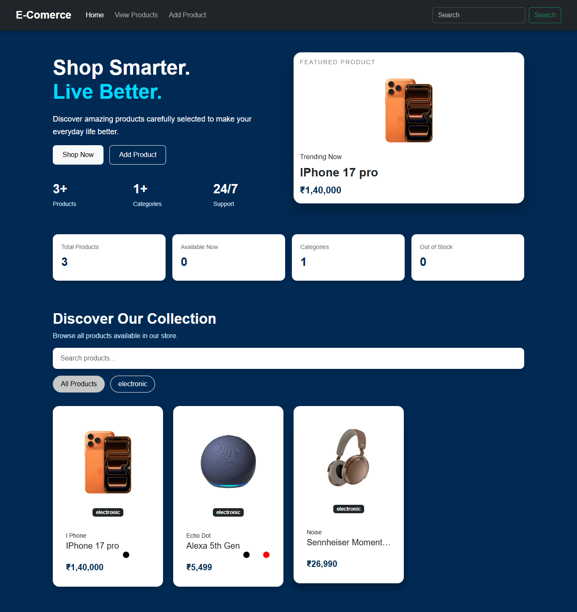
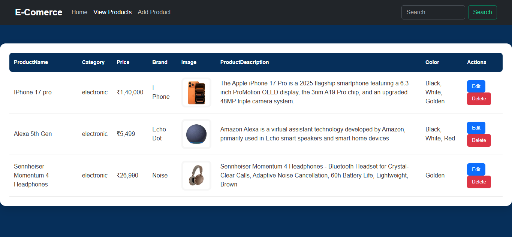
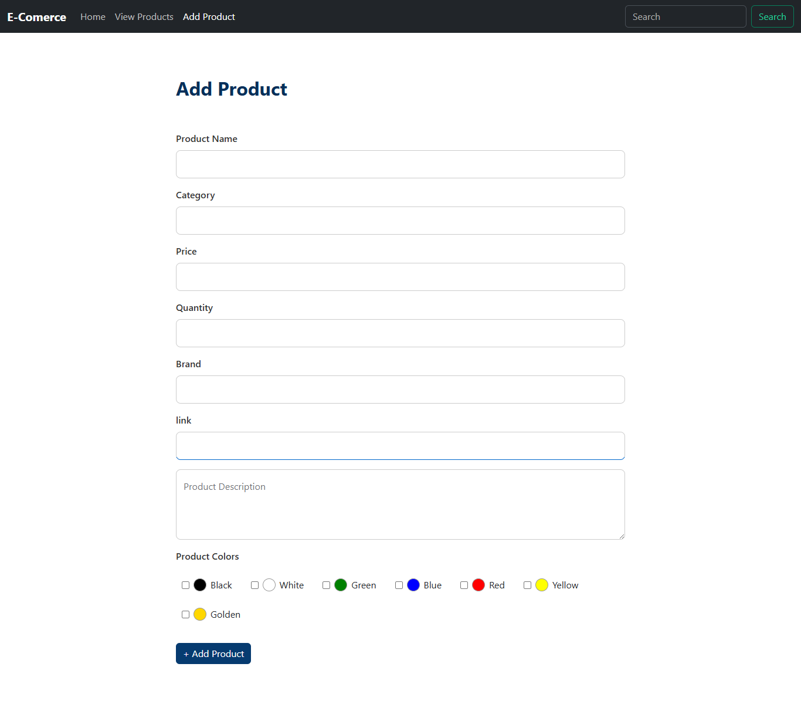
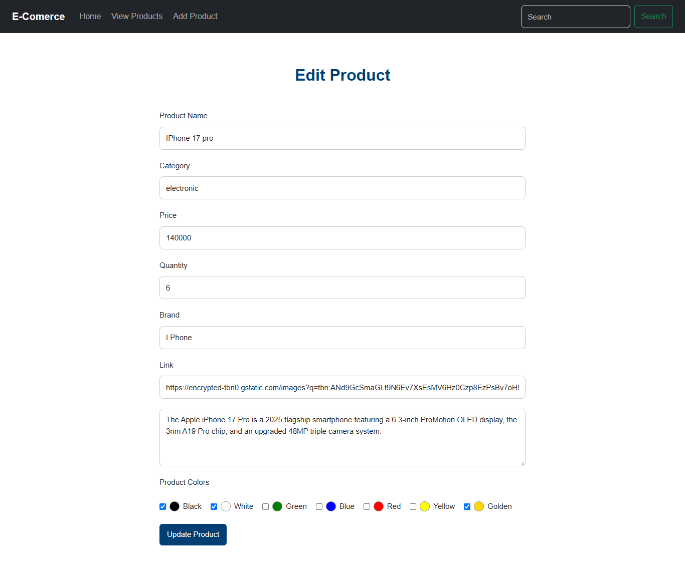
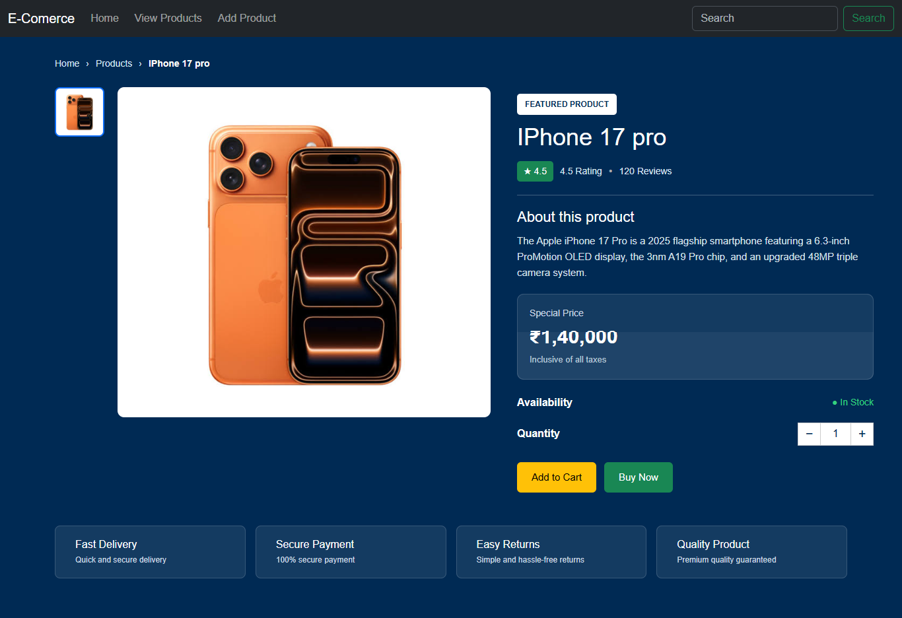

# E-Commerce Website

A modern **E-Commerce Product Management Website** built using **HTML,
CSS, and JavaScript**.\
The project provides a clean shopping interface together with product
management features such as adding, editing, deleting, searching,
filtering, and viewing product details.

## Tech Stack

-   **HTML5** --- Page structure and semantic markup
-   **CSS3** --- Styling, layout, responsive design, cards, forms and UI
    components
-   **JavaScript (ES6+)** --- Dynamic product rendering, search,
    filtering, CRUD interactions and UI behavior
-   **Git / GitHub** --- Version control and project hosting

> This version is a frontend web project using HTML, CSS and JavaScript.
> If a backend/database is added later, document it separately here.

------------------------------------------------------------------------

## Features

### Home Page

-   Featured product section
-   Product statistics
-   Product discovery section
-   Product search
-   Category filters
-   Product cards
-   Quick navigation to shopping and product creation



------------------------------------------------------------------------

### View Products

A complete product management table showing:

-   Product name
-   Category
-   Price
-   Brand
-   Product image
-   Product description
-   Available colors
-   Edit button
-   Delete button



------------------------------------------------------------------------

### Add Product

The product creation form supports:

-   Product name
-   Category
-   Price
-   Quantity
-   Brand
-   Product image/link
-   Product description
-   Multiple product colors



------------------------------------------------------------------------

### Edit Product

Existing products can be opened and updated through the edit form.



------------------------------------------------------------------------

### Product Details

The product details page provides a shopping-focused view with:

-   Product image
-   Product title
-   Rating and reviews
-   Product description
-   Special price
-   Availability
-   Quantity selector
-   Add to Cart button
-   Buy Now button
-   Delivery information
-   Secure payment information
-   Easy returns information
-   Quality product information



------------------------------------------------------------------------

## Product Management

The application follows a simple CRUD workflow:

``` text
Create
  ↓
Add Product
  ↓
View Products
  ↓
Edit / Delete
  ↓
View Product Details
```

### CRUD Operations

  Operation   Function
  ----------- --------------------------------------
  Create      Add a new product
  Read        Display products and product details
  Update      Edit existing product information
  Delete      Remove a product

------------------------------------------------------------------------

## Product Information

Each product can contain:

  Field          Example
  -------------- ----------------------
  Product Name   IPhone 17 pro
  Category       electronic
  Price          ₹1,40,000
  Quantity       6
  Brand          I Phone
  Image          Product image URL
  Description    Product information
  Colors         Black, White, Golden

------------------------------------------------------------------------

## Search & Filtering

The interface includes:

-   Global product search
-   Product collection search
-   Category-based filtering
-   All Products filter

This allows users to quickly find products from the collection.

------------------------------------------------------------------------

## UI Design

The website uses a modern e-commerce design featuring:

-   Dark navigation bar
-   Deep blue background
-   White product cards
-   Rounded corners
-   Responsive layouts
-   Clean typography
-   Product-focused cards
-   Clear action buttons
-   Search controls
-   Product statistics

------------------------------------------------------------------------

## Project Structure

Recommended project structure:

``` text
E-Commerce/
│
├── index.html
├── products.html
├── add-product.html
├── edit-product.html
├── product-details.html
│
├── css/
│   └── style.css
│
├── js/
│   └── script.js
│
├── images/
│   ├── product-1.png
│   ├── product-2.png
│   └── product-3.png
│
├── screenshots/
│   ├── home.png
│   ├── products.png
│   ├── add-product.png
│   ├── edit-product.png
│   └── product-details.png
│
└── README.md
```

> Rename the files in this structure if your actual project uses
> different filenames.

------------------------------------------------------------------------

## How to Run

Because this project is built with HTML, CSS and JavaScript, it can be
run directly in a browser.

### Option 1 --- Open HTML

Open:

``` text
index.html
```

in your browser.

### Option 2 --- VS Code Live Server

1.  Open the project folder in VS Code.
2.  Install the **Live Server** extension.
3.  Right-click `index.html`.
4.  Select **Open with Live Server**.

------------------------------------------------------------------------

## Screenshots

The repository contains the screenshots used in this README:

``` text
screenshots/
├── home.png
├── products.png
├── add-product.png
├── edit-product.png
└── product-details.png
```

### Full Project Preview

#### Home


#### Products


#### Add Product


#### Edit Product


#### Product Details


------------------------------------------------------------------------

## Future Improvements

Possible future features:

-   Shopping cart
-   Checkout page
-   User login and registration
-   Wishlist
-   Order history
-   Product reviews
-   Product pagination
-   Advanced filters
-   Image upload
-   Backend API
-   Database integration
-   Admin dashboard
-   Payment gateway
-   Mobile navigation
-   Deployment to a cloud platform

------------------------------------------------------------------------

## Learning Outcomes

This project demonstrates practical knowledge of:

-   HTML page structure
-   CSS layouts and responsive UI
-   JavaScript DOM manipulation
-   JavaScript event handling
-   CRUD concepts
-   Search and filtering
-   Product data handling
-   Form handling
-   E-commerce UI design
-   Frontend project organization

------------------------------------------------------------------------

## Author

**YASH**

Full Stack-Web Devlopment

------------------------------------------------------------------------