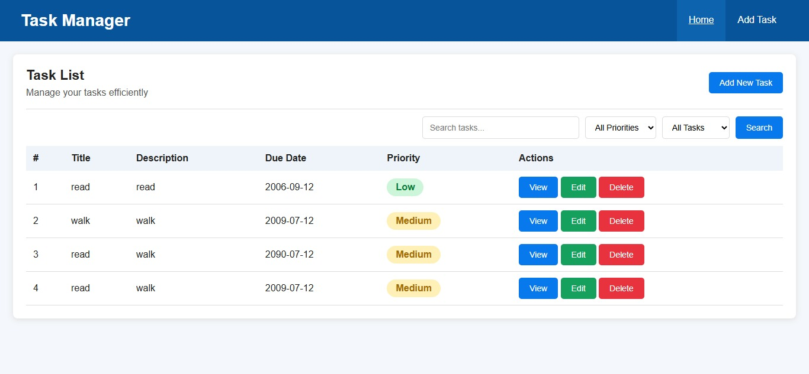
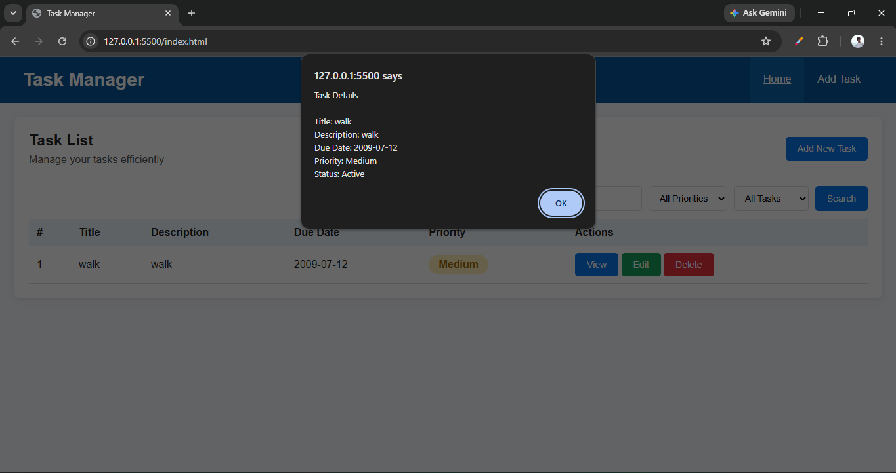

# Task Manager

A modern **Task Management Website** built using **HTML, CSS, and JavaScript**.  
The project provides a clean task management interface together with features such as adding, editing, deleting, searching, filtering, viewing, and completing tasks.

## Tech Stack

- **HTML5** --- Page structure and semantic markup
- **CSS3** --- Styling, layout, responsive design, forms and UI components
- **JavaScript (ES6+)** --- Dynamic task rendering, search, filtering, CRUD interactions and UI behavior
- **Local Storage** --- Browser-based task data storage
- **Git / GitHub** --- Version control and project hosting

> This version is a frontend web project using HTML, CSS and JavaScript.
> Task data is stored in the browser using Local Storage.

**------------------------------------------------------------------------**

## Features

### Home Page

The home page provides a complete task management dashboard with:

- Task list
- Task search
- Priority filters
- Status filters
- Task details
- View button
- Edit button
- Delete button
- Complete / Undo button
- Quick navigation to add a new task



**------------------------------------------------------------------------**

### Add Task

The task creation form supports:

- Task title
- Task description
- Due date
- Task priority
- Add Task button
- Clear button


**------------------------------------------------------------------------**

### Edit Task

Existing tasks can be opened and updated through the edit form.

Users can modify:

- Task title
- Task description
- Due date
- Priority


**------------------------------------------------------------------------**

### View Task

The task details view provides information about the selected task with:

- Task title
- Task description
- Due date
- Priority
- Task status



**------------------------------------------------------------------------**

## Task Management

The application follows a simple CRUD workflow:

```text
Create
  ↓
Add Task
  ↓
View Tasks
  ↓
Edit / Update
  ↓
Complete / Undo
  ↓
Delete Task